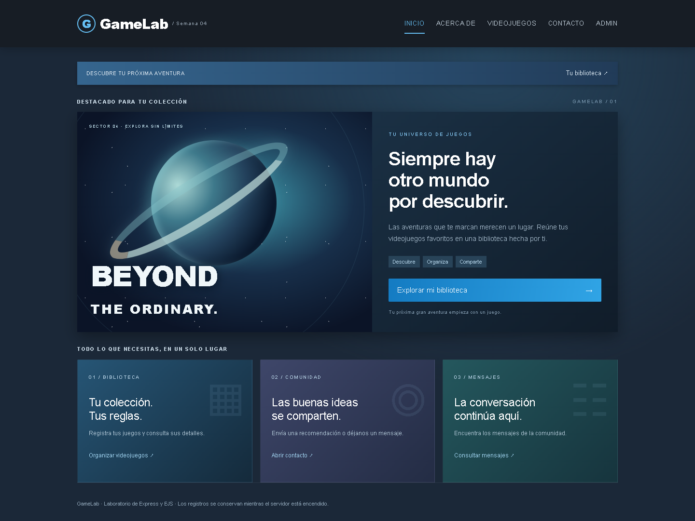
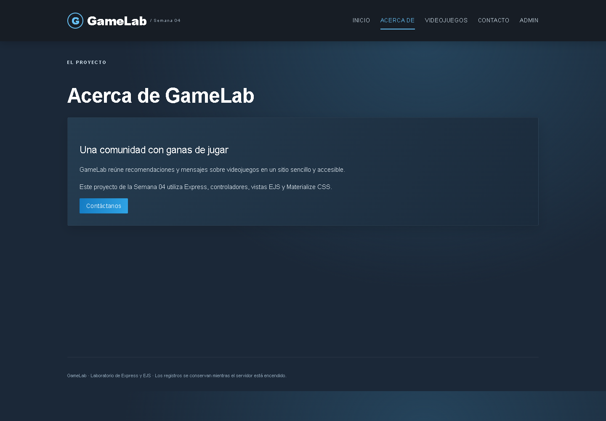
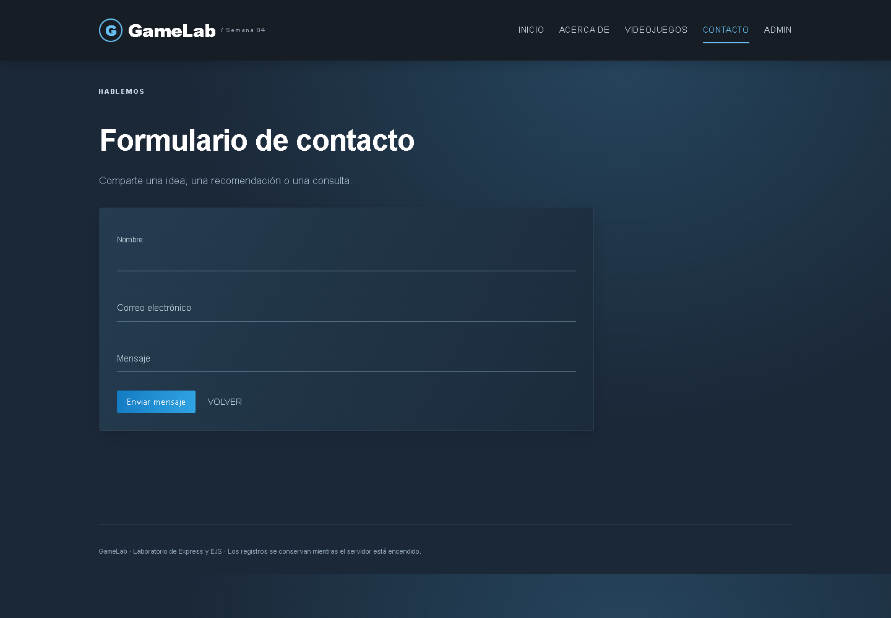
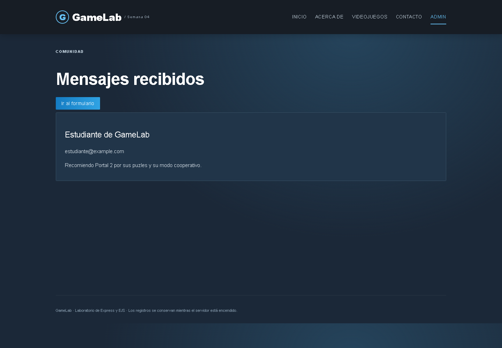
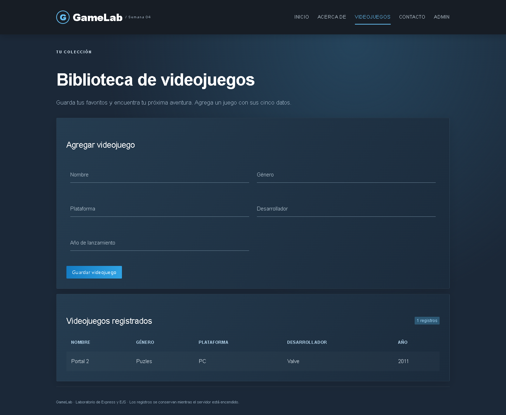
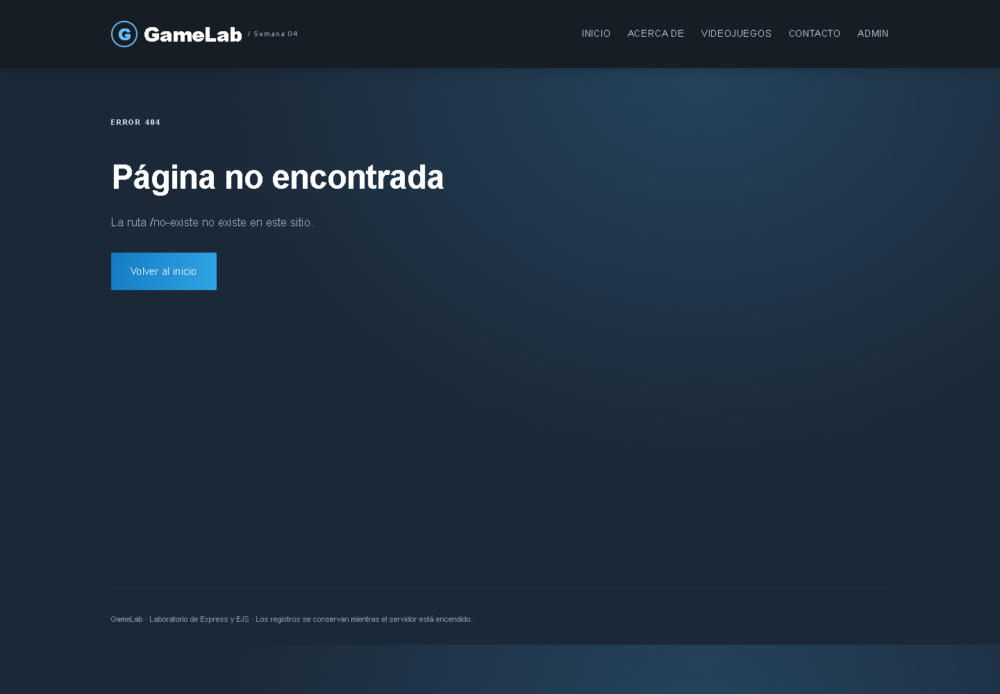

# Semana 04 — Sitio web con Express

Proyecto del laboratorio ampliado con contacto, administración de mensajes, página 404 y una biblioteca de videojuegos.

Repositorio: https://github.com/Gonnarch/DesAplWav

## Ejecutar

Requisitos: Node.js y npm. Desde esta carpeta:

```sh
npm install
npm start
```

Abrir http://localhost:3000. Materialize CSS 1.0.0 está incluido en public/vendor y funciona sin conexión después de instalar las dependencias.

## Funciones implementadas

- Inicio y Acerca de con un menú compartido hacia todas las secciones.
- GET /contact: formulario de nombre, email y mensaje.
- POST /contact: valida los datos, los guarda en memoria, los muestra en consola y redirige a Admin.
- GET /admin: lista los mensajes o informa cuando no hay ninguno.
- GET /games: formulario y tabla de videojuegos, mediante un controlador independiente.
- POST /games: registra nombre, género, plataforma, desarrollador y año de lanzamiento.
- Cualquier ruta inexistente devuelve HTTP 404 y una vista con la dirección solicitada y un enlace al inicio.
- Estilos Materialize CSS en las vistas.

Los mensajes y videojuegos se guardan en arreglos; se pierden al reiniciar el servidor. Los datos que aparecen en las capturas son ejemplos ingresados durante la verificación. Admin es una vista del laboratorio sin autenticación.

## Verificación

```sh
npm test
```

La prueba comprueba las cinco páginas, el envío de contactos, la redirección, el registro y listado de videojuegos, el rechazo de datos inválidos, la salida segura del texto recibido y el estado HTTP 404. También se verificaron los formularios desde el navegador.

## Diseño visual

Interfaz inspirada en la tienda de Steam (https://store.steampowered.com/): paleta oscura, acentos azules, bloque destacado y tarjetas de acceso. Se mantiene Materialize CSS local. La ilustración espacial está construida con CSS.

## Capturas del resultado en el navegador

### Inicio


### Acerca de


### Contacto


### Mensajes recibidos


### Formulario y tabla de videojuegos


### Página 404


## Cinco observaciones

1. El procesamiento de formularios requiere colocar express.urlencoded antes de las rutas que utilizan req.body.
2. Los arreglos conservan los registros entre solicitudes, pero su contenido desaparece al reiniciar el proceso.
3. El middleware 404 debe colocarse después de las rutas para permitir que Express resuelva primero las páginas existentes.
4. La carga de Materialize desde el CDN no funcionó durante la revisión; incluir sus archivos localmente permitió mantener el diseño sin depender de esa conexión.
5. La validación del navegador ayuda al usuario, pero también se necesita validación en el servidor para rechazar datos incompletos o inválidos.

## Cinco conclusiones

1. La separación de rutas, controladores y vistas permitió ampliar el ejemplo sin concentrar toda la lógica en app.js.
2. El formulario de contacto demuestra el flujo completo: recepción de datos, validación, almacenamiento y presentación en otra página.
3. EJS permite reutilizar el menú y el pie de página, además de mostrar los registros con escape de texto para evitar interpretar HTML enviado por el usuario.
4. Materialize y los estilos locales permiten mantener una presentación consistente entre los formularios, las tablas y la página de error.
5. Las comprobaciones automáticas y las pruebas del navegador ayudan a verificar tanto el comportamiento como la presentación; una base de datos sería necesaria si se quisiera conservar los registros después de reiniciar.
