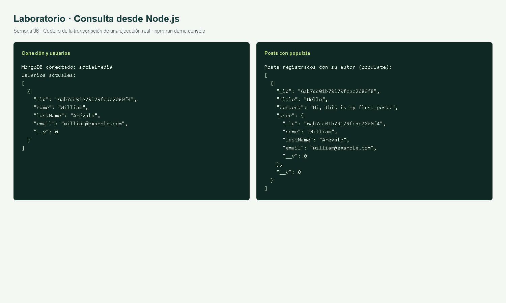
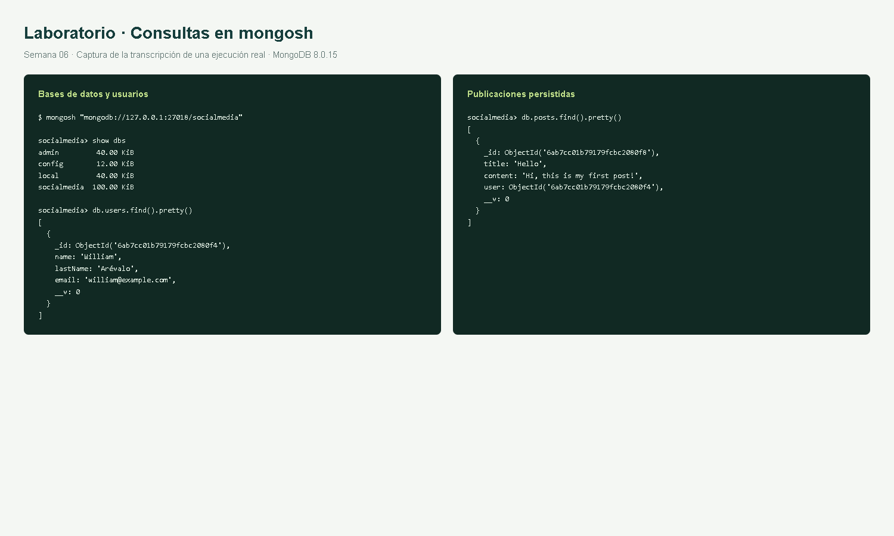
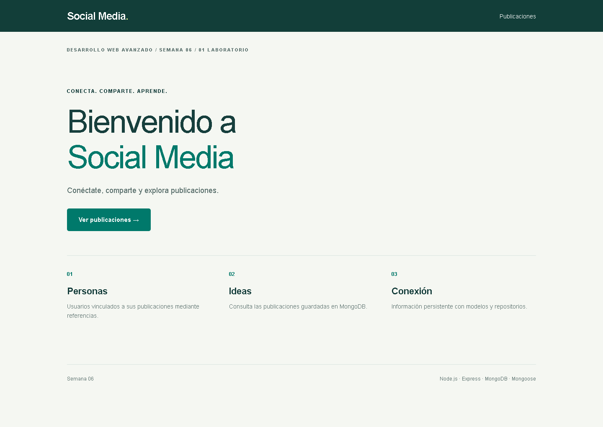
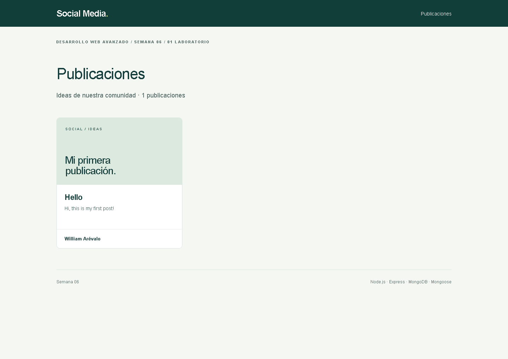

# 01 Laboratorio — Node.js y MongoDB

Primera parte de la guía GLAB-S06-EAREVALO-2026-1. Se conserva esta versión antes de incorporar la tarea.

## 1. Configuración del proyecto

Requisitos: Node.js 20 o posterior y MongoDB en ejecución. Desde esta carpeta:

```powershell
cd mongo-node
npm ci
Copy-Item .env.example .env
```

El archivo `.env` debe contener:

```dotenv
MONGO_URI=mongodb://127.0.0.1:27017/socialmedia
PORT=3001
```

`127.0.0.1` corresponde al servidor local. Si MongoDB está en otra dirección, ajustar `MONGO_URI`. `.env` se mantiene fuera de Git; `.env.example` permite reproducir la configuración.

## 2. Conexión, modelos y repositorios

`src/db/database.js` conecta Mongoose a MongoDB. Los modelos `User` y `Post` conservan los campos básicos del laboratorio. `Post.user` referencia a `User`; las consultas de publicaciones usan `populate('user')` para recuperar al autor.

```text
mongo-node/
├── app.js
├── package.json
├── package-lock.json
├── .env.example
├── scripts/
│   ├── seed.js
│   └── demo-console.js
└── src/
    ├── db/database.js
    ├── models/{User,Post}.js
    ├── repositories/{userRepository,postRepository}.js
    ├── services/postService.js
    ├── controllers/postController.js
    ├── routes/{home,post}.routes.js
    ├── views/
    ├── public/
    └── server.js
```

## 3. Manipulación de datos desde Node.js

```powershell
npm run seed
npm run demo:console
```

El primer comando crea un usuario ficticio y el post `Hello`. Puede repetirse sin duplicar el ejemplo. El segundo consulta los usuarios y las publicaciones con su autor y cierra la conexión. Estos scripts conservan el ejercicio de consola que la guía luego reemplaza al convertir `app.js` en servidor web.



## 4. Consulta desde mongosh

```text
mongosh "mongodb://127.0.0.1:27017/socialmedia"
show dbs
use socialmedia
db.users.find().pretty()
db.posts.find().pretty()
```



Se incluyen también las transcripciones de texto en `evidencias/`. Las imágenes de consola son representaciones de esas salidas reales, generadas para hacerlas legibles en el informe.

## 5. Integración con Express y EJS

```powershell
npm run dev
```

Abrir [inicio](http://localhost:3001/) y [publicaciones](http://localhost:3001/posts). La vista recorre los registros de MongoDB; no muestra una tarjeta fija.

| Método | Ruta | Función |
| --- | --- | --- |
| GET | `/` | Inicio |
| GET | `/posts` | Listar publicaciones con su autor |
| POST | `/posts/user/:userId` | Crear publicación mediante JSON |




## Ajustes necesarios para ejecutar la guía

Se agregó `type: module` porque los archivos utilizan `import`. La conexión y las inserciones se esperan con `await`; `connectDB()` es asíncrono. Se retiraron `useNewUrlParser` y `useUnifiedTopology`, opciones que ya no corresponden al controlador usado por Mongoose 8. Express y EJS están declarados como dependencias. Las funciones de creación y consulta de consola se guardaron por separado para poder repetir todo el procedimiento en orden.

Continuar con [02 Tarea](../02-tarea/README.md) después de detener este servidor con `Ctrl+C`.
