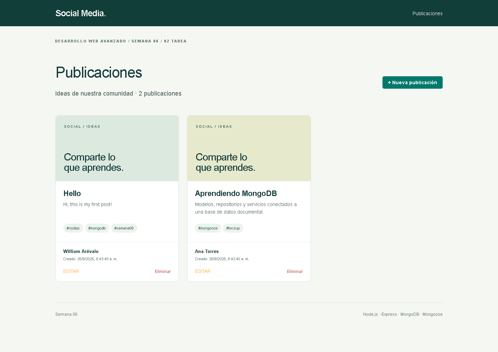
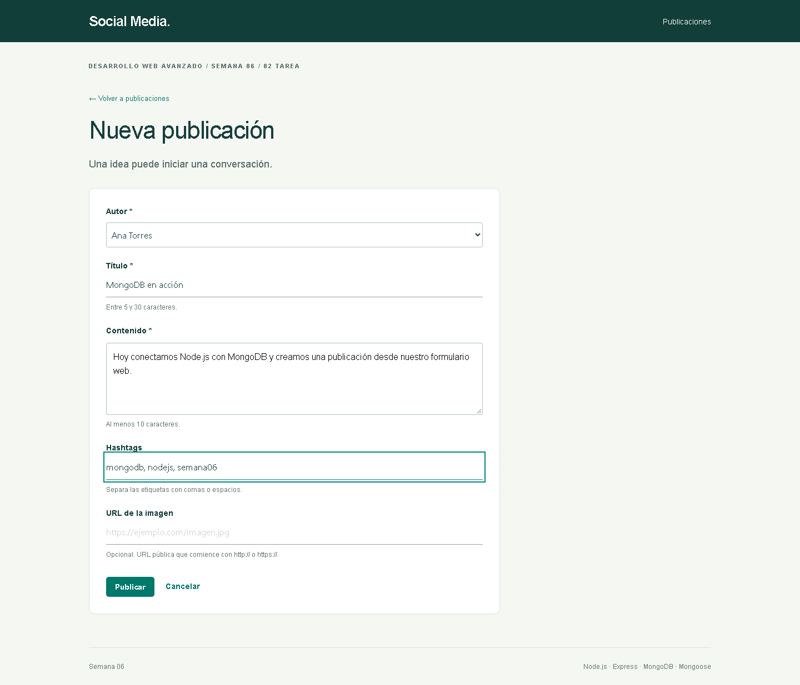
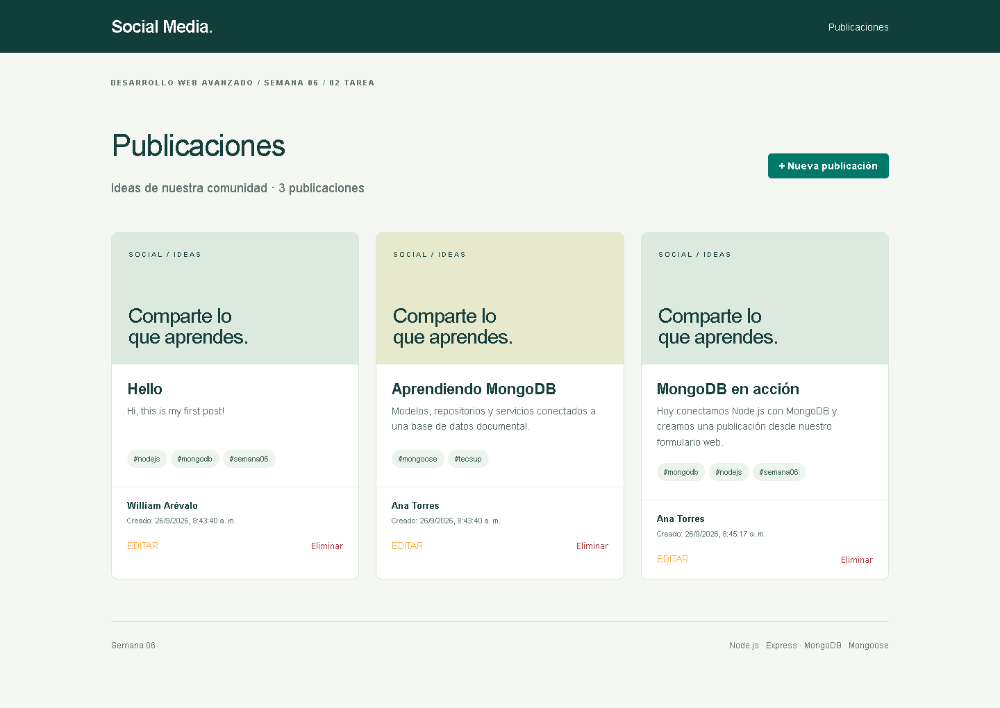
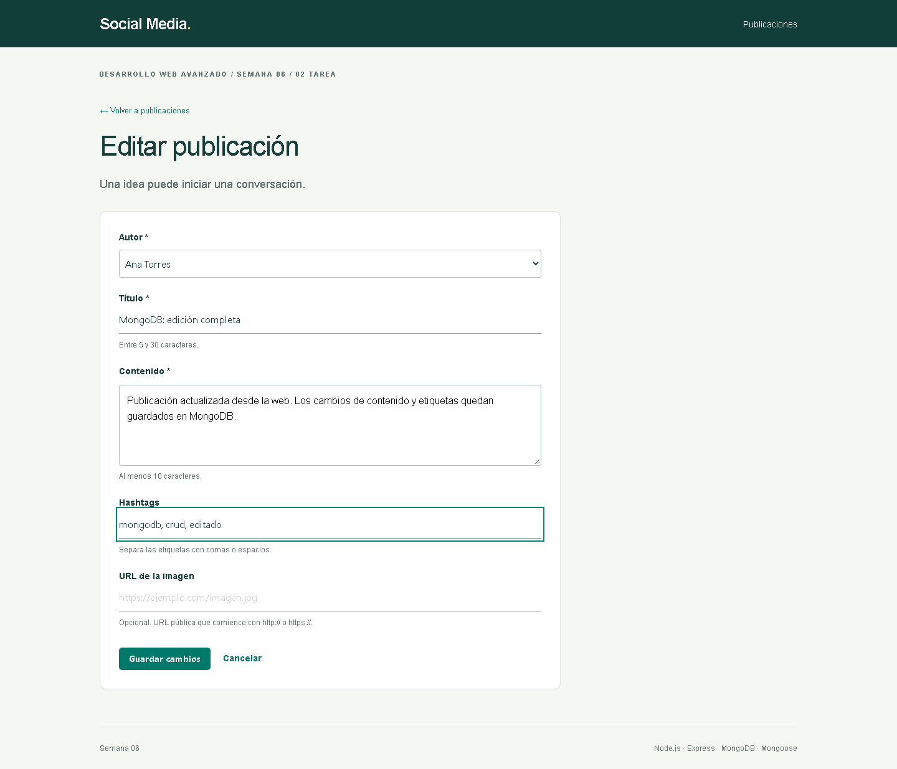
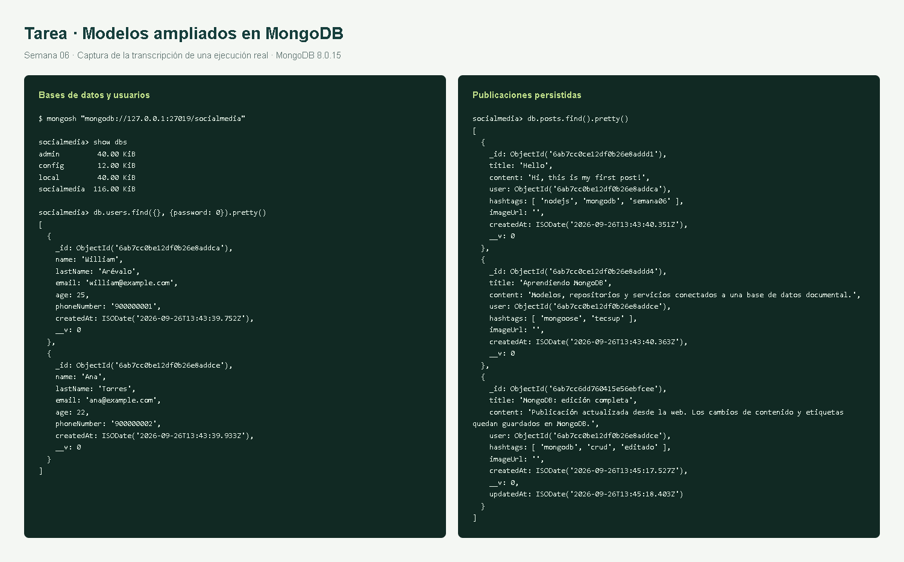

# 02 Tarea — Validaciones y CRUD de publicaciones

Esta etapa amplía el laboratorio con todos los campos y operaciones solicitados. Es un proyecto independiente para conservar el resultado de la primera etapa.

## 1. Preparación

Detener el servidor del laboratorio antes de usar el mismo puerto. Desde esta carpeta:

```powershell
cd mongo-node
npm ci
Copy-Item .env.example .env
npm run seed
npm run dev
```

Abrir [Social Media](http://localhost:3001/). Se utiliza `socialmedia` en el MongoDB local configurado en `.env`. Los usuarios del laboratorio pueden seguir siendo autores. La carga de ejemplos agrega una segunda autora y dos publicaciones si todavía no existen; no borra información.

## 2. Modelos ampliados

| Modelo | Campo | Restricción |
| --- | --- | --- |
| User | age | Number, obligatorio, mínimo 18 |
| User | phoneNumber | String |
| User | password | String, obligatorio, mínimo 8 caracteres |
| User | createdAt | Date, valor predeterminado `Date.now` |
| Post | title | String, obligatorio, entre 5 y 30 caracteres |
| Post | content | String, obligatorio, mínimo 10 caracteres |
| Post | hashtags | Arreglo de String |
| Post | imageUrl | String; si se proporciona, URL HTTP o HTTPS |
| Post | createdAt | Date, valor predeterminado `Date.now` |
| Post | updatedAt | Date, se establece al editar |

La contraseña se valida antes del guardado y se almacena como hash con sal mediante `scrypt`; no se incluye en las consultas normales. Esta práctica no incorpora inicio de sesión: el formulario permite elegir entre los autores existentes. Está preparada para uso local y el servidor escucha en `127.0.0.1`.

Las fechas de creación se generan en el servidor. La actualización aplica `runValidators: true`, conserva `createdAt` y asigna `updatedAt`. El servicio recibe únicamente los campos editables, verifica que el autor exista y convierte los hashtags separados por comas o espacios en un arreglo sin duplicados. Las vistas EJS escapan el contenido.

Referencia: [SchemaTypes de Mongoose](https://mongoosejs.com/docs/schematypes.html).

## 3. CRUD desde la aplicación web

| Método | Ruta | Operación |
| --- | --- | --- |
| GET | `/` | Inicio |
| GET | `/posts` | Publicaciones de todos los usuarios |
| GET | `/posts/new` | Formulario de registro |
| POST | `/posts` | Crear publicación |
| GET | `/posts/:id/edit` | Formulario de edición |
| POST | `/posts/:id/update` | Actualizar publicación |
| POST | `/posts/:id/delete` | Eliminar con confirmación en el navegador |

Los formularios HTML emplean POST para actualizar y eliminar. Un enlace GET nunca elimina registros. Los errores de validación conservan los datos del formulario y muestran un mensaje. Las publicaciones inexistentes devuelven 404; los identificadores inválidos devuelven 400.

1. Entrar en **Publicaciones** y revisar los posts de ambos autores.
2. Elegir **Nueva publicación**, completar autor, título, contenido, hashtags e imagen opcional, y publicar.
3. Elegir **Editar**, cambiar los campos y guardar.
4. Elegir **Eliminar** y confirmar; la publicación desaparece de la lista y de MongoDB.

## 4. Capturas de resultados







## 5. Consultas de MongoDB

```text
mongosh "mongodb://127.0.0.1:27017/socialmedia"
show dbs
use socialmedia
db.users.find({}, {password: 0}).pretty()
db.posts.find().pretty()
```

La proyección excluye los hashes de contraseñas del informe. Las evidencias muestran los campos nuevos y la persistencia de los cambios antes de borrar la publicación de prueba.



Las imágenes de consola representan las transcripciones reales de `evidencias/`; no se simularon respuestas de MongoDB.

## 6. Pruebas

```powershell
npm test
```

Sin una URI de prueba se ejecutan las validaciones de modelos y se omite explícitamente la integración. Para ejecutar también el CRUD sobre MongoDB:

```powershell
$env:TEST_MONGO_URI = 'mongodb://127.0.0.1:27017'
npm test
Remove-Item Env:TEST_MONGO_URI
```

La prueba de integración crea una base exclusiva `semana06_test_<fecha>` y elimina solamente esa base al terminar. Verifica creación, consulta, edición, eliminación, relación con autores, contraseña hasheada, correo único, validación de actualizaciones, fechas, escape HTML y respuestas ante identificadores incorrectos. El resultado de la ejecución realizada se encuentra en [pruebas.txt](evidencias/pruebas.txt).

## 7. Cinco conclusiones

1. Separar modelos, repositorios, servicios y controladores facilitó ampliar el laboratorio sin mezclar consultas con vistas. Para este ejercicio la estructura implica más archivos, pero hace más claro dónde corregir cada problema.
2. Esperar la conexión con `await` evitó iniciar el servidor antes de que MongoDB estuviera disponible. También se conservó el ejercicio de consola en scripts independientes para poder repetir la primera parte sin reemplazar el servidor.
3. Las restricciones de los esquemas protegen los datos aunque se omitan las validaciones del navegador. Fue necesario activar `runValidators` en las actualizaciones para que un título inválido tampoco se pudiera guardar durante la edición.
4. La referencia entre `Post` y `User`, junto con `populate`, permitió mostrar publicaciones de distintos autores. MongoDB no garantiza por sí solo la existencia del autor referenciado, por lo que el servicio realiza esa comprobación antes de escribir.
5. Las pruebas de CRUD y las consultas con mongosh permitieron contrastar lo mostrado en la web con lo persistido en MongoDB. La práctica cumple el flujo solicitado, pero una publicación en Internet requeriría autenticación y permisos por autor; seleccionar un autor en el formulario solo es apropiado para esta demostración local.

Repositorio: [Gonnarch/DesAplWav — Semana06](https://github.com/Gonnarch/DesAplWav/tree/main/Semana06).
